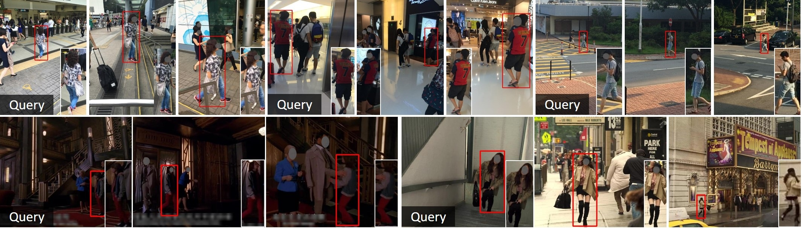

# PSTR (CVPR2022)


- This code is an official implementation of "[*PSTR: End-to-End One-Step Person Search With Transformers (CVPR2022)*](https://arxiv.org/abs/2204.03340)". 
- **End-to-end one-step person search** with Transformers, which does not requre NMS post-processing.
- **Pre-trained models** with ResNet50, ResNet50-DCN, and PVTv2b2.
- **Curves of different methods** on CUHK under different gallery sizes ([plot_cuhk.py](plot_cuhk.py)). If you want to add new results, please feel free to contact us.

<tr>
<div align="center">
  
</div>
</tr>

## Installation
- We install this project using cuda11.1 and PyTorch1.8.0 (or PyTorch1.9.0) as follows.


 ```bash
# Download this project
git clone https://github.com/JialeCao001/PSTR.git

# Create a new conda enviroment for PSTR
conda create -n pstr python=3.7 -y
conda activate pstr
pip install torch==1.8.1+cu111 torchvision==0.9.1+cu111 torchaudio==0.8.1 -f https://download.pytorch.org/whl/torch_stable.html
#conda install pytorch==1.8.0 torchvision==0.9.0 torchaudio==0.8.0 cudatoolkit=11.1 -c pytorch -c conda-forge

# Comiple mmcv, which has been included in this project
cd PSTR/mmcv
MMCV_WITH_OPS=1 pip install -e .

# Comiple this project 
cd PSTR
pip install -r requirements/build.txt
pip install -v -e .  # or "python setup.py develop"
pip install sklearn
```

- If you have the problem ```local variable 'beta1' referenced before assignment``` with PyTorch1.8, add one table space in L110 of [```optim/adamw.py```](https://github.com/pytorch/pytorch/issues/55740)

## Train and Inference


#####  Datasets and Annotations

- Download [PRW](https://github.com/liangzheng06/PRW-baseline) and [CUHK-SYSU](https://github.com/ShuangLI59/person_search) datasets.
- Download the [json annotations](https://drive.google.com/file/d/1J2YAU7n954TiSwqopJCWdK25IaF6Mb9_/view?usp=sharing) provided by [AlignPS](https://github.com/daodaofr/AlignPS).


#####  Train with a single GPU
```shell
python tools/train.py ${CONFIG_FILE} --no-validate
```
- CONFIG_FILE about PSTR is in [configs/PSTR](configs/pstr)

#####  Test with a single GPU

```shell
PRW: sh run_test_prw.sh 
CUHK: sh run_test_cuhk.sh  
```

- If you want to output the results of different models, please  change CONFIGPATH, MODELPATH, OUTPATH for diffferent models


## Results

We provide some models with different backbones and results on PRW and CUHK-SYSU datasets, which have a little difference to CVPR version due to jitter.

|    name  | dataset  | backbone |  mAP  | top-1 |  mAP+ | top-1+  | download|
| :-------------: | :-----: | :-----: | :-------------------: | :-----: | :-----: | :------: | :-----------------: |
|     PSTR | PRW    | PVTv2-B2  |   57.46  |   90.57   |58.07   |    92.03     |          [model](https://drive.google.com/file/d/1hrmyvS9f8fzflpoIlEhWQ-XDyNp_qCGq/view?usp=sharing)         |
|     PSTR |  PRW   | ResNet50  |   50.03   | 88.04   | 50.64   |    89.94   |        [model](https://drive.google.com/file/d/12j71smXyc3QAyCvIPRlQCbyhSXZENBIX/view?usp=sharing)         |
|     PSTR |  PRW   | ResNet50-DCN  |   51.09   | 88.33   | 51.62   |    90.13   |        [model](https://drive.google.com/file/d/111f_efZOYMFkz9i76TgqcO7a88npoJV5/view?usp=sharing)         |
|     PSTR | CUHK-SYSU     | PVTv2-B2    |   95.31  |   96.28   |95.78   |    96.83      |       [model](https://drive.google.com/file/d/1vrQdZTVgJ2D6ty_XJAYmsJgziW9TZHHW/view?usp=sharing)         |
|     PSTR | CUHK-SYSU    | ResNet50|   93.55   | 94.93   | 94.16   | 95.48   |          [model](https://drive.google.com/file/d/1U4r_WaTfODmuhslL_15u5bXdFwLLBC5m/view?usp=sharing)         |
|     PSTR | CUHK-SYSU    | ResNet50-DCN|   94.22   | 95.28   | 94.90   | 95.97   |          [model](https://drive.google.com/file/d/1cCbpAGrldxQaRrF7FCZXqx4VaNP-C278/view?usp=sharing)         |

- All the models are based on multi-scale training and all the results are based on single-scale inference.

- \+ indicates adding a re-scoring module during evaluation, where we modify the final matching score as the weighted score of [CBGM](https://github.com/serend1p1ty/SeqNet) score and originial matching scores. 

## Citation
If the project helps your research, please cite this paper.

```
@article{Cao_PSTR_CVPR_2022,
  author =       {Jiale Cao and Yanwei Pang and Rao Muhammad Anwer and Hisham Cholakkal and Jin Xie and Mubarak Shah and Fahad Shahbaz Khan},
  title =        {PSTR: End-to-End One-Step Person Search With Transformers},
  journal =      {Proc. IEEE Conference on Computer Vision and Pattern Recognition},
  year =         {2022}
}
```

## Acknowledgement
Many thanks to the open source codes: [mmdetection](https://github.com/open-mmlab/mmdetection), [AlignPS](https://github.com/daodaofr/AlignPS), and [SeqNet](https://github.com/serend1p1ty/SeqNet).
